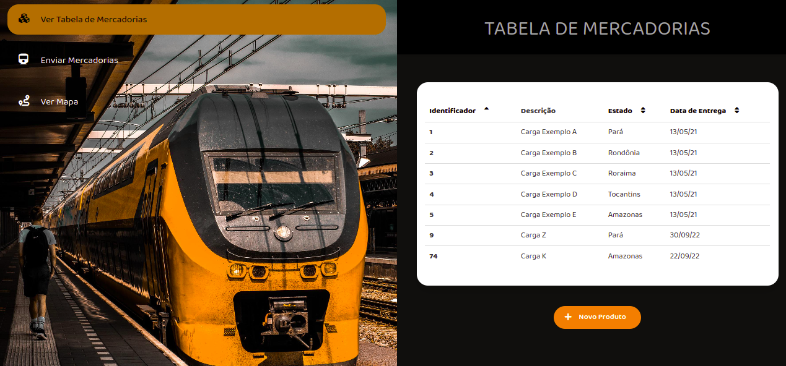
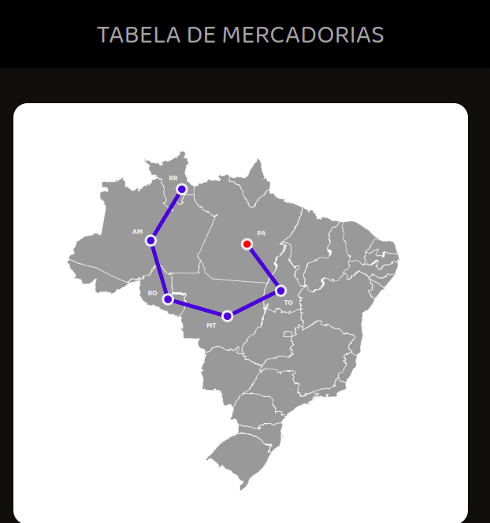

# Freight Train

**Número da Lista**: 3<br>
**Conteúdo da Disciplina**: Grafos e Dividir e Conquistar<br>

## Alunos

| Matrícula  | Aluno                   |
| ---------- | ----------------------- |
| 19/0046091 | Gustave Augusto Persijn |
| 19/0032863 | Lorrayne Alves Cardozo  |

## Sobre

O projeto tem o objetivo de utilizar os algoritmos de Grafos e Dividir e Conquistar em uma aplicação real, que consiste em organizar as cargas de um trem por localização e apresentar por meio de grafos a melhor rota a ser seguida para fazer as entregas.

## Screenshots






## Instalação

### Frameworks 
- ReactJS 
- NodeJS

### Rodando backend
```
cd backend
npm install
npm start
```
O backend estará rodando na porta ```localhost:3001```

### Rodando frontend
```
cd frontend
npm install
npm start
```
O frontend estará rodando na porta ```localhost:3000```

## Apresentação

[Link da apresentação](https://youtu.be/V9tOqZjW72o)